# Cafe SCM

**Internal supply-chain and inventory app for a small food business: 3 food carts and one central store.**

Workers tap what they sold on their phone. The app works out which raw materials each sale used,
deducts them from that cart's stock, and gives the owner a live view of sales, stock, shortages,
wastage and costs across every location.

> **Core principle — workers record _events_, the database calculates _inventory_.**
> Nobody types "we have 17 buns left". Stock is always the sum of recorded events
> (sales, receipts, wastage, transfers, counts), so every number can be traced back to what caused it.

| | |
|---|---|
| **Users** | 1 owner (admin) · 1 worker per cart (username + 6-digit PIN) |
| **Locations** | Central Storage · Cart 1 · Cart 2 · Cart 3 |
| **Runs on** | Any phone or laptop browser; installable as an app (PWA); works offline for sales |
| **Stack** | Next.js 16 · React 19 · TypeScript · Tailwind CSS 4 · Supabase (Postgres, Auth, Row Level Security, Realtime) · Vercel |
| **Timezone / currency** | India Standard Time · ₹ INR |
| **Tests** | 147 automated tests, including the database rules, run against real Postgres (PGlite) |

---

## Contents

1. [What it does](#1-what-it-does)
2. [How it works — architecture](#2-how-it-works--architecture)
3. [From a sale to stock: the ledger](#3-from-a-sale-to-stock-the-ledger)
4. [Data model](#4-data-model)
5. [Business rules](#5-business-rules)
6. [Stock alerts and runway](#6-stock-alerts-and-runway)
7. [Offline mode](#7-offline-mode)
8. [Security](#8-security)
9. [Screens](#9-screens)
10. [Excel import and exports](#10-excel-import-and-exports)
11. [Setup](#11-setup)
12. [Deployment](#12-deployment)
13. [Go-live checklist](#13-go-live-checklist)
14. [Development](#14-development)
15. [Project structure](#15-project-structure)
16. [Troubleshooting](#16-troubleshooting)

---

## 1. What it does

### For cart workers (phone, one hand, a few taps)

| Tab | What the worker does | What the system does |
|---|---|---|
| **Sell** | Taps product tiles (Burger +, Fries +…) → **Submit order** | Saves the order and deducts every ingredient of every product, in one step |
| **Receive** | Picks what arrived from a shop/supplier, quantity (kg/g/l/ml/pcs), optional price | Adds stock to the cart; updates the material's average cost |
| **Waste** | Material, quantity, reason (dropped / spoiled / damaged / expired / prep / other) | Removes stock; records the cost of the loss |
| **Stock** | Sees the cart's stock; confirms deliveries on the way ("Received all" or what actually arrived); counts stock | Adds delivered stock; sends counts to the owner for approval |
| **More** | Requests stock, sends stock to another location, sees today's activity and anything waiting to sync | — |

### For the owner (phone or laptop)

- **Dashboard** — *what needs attention* first (critical stock, requests waiting, counts to approve, deliveries not received), then today's orders, sales, ingredient cost, purchases and wastage vs the previous period, stock alerts and one card per cart. Updates live.
- **Inventory** — every material × every location, with value, status and days of stock left; each material's full movement history.
- **Analytics** — sales and wastage trends, peak hours, product sales, *material use vs sales* (inventory variance), what to buy, supplier and price history, cost and estimated gross margin per product.
- **Operations** — orders (void with reason), requests, transfers, purchases, wastage, stock counts.
- **Setup** — products and versioned recipes, raw materials and reorder levels, suppliers, users, settings, **Excel import**, **reports export**.

---

## 2. How it works — architecture

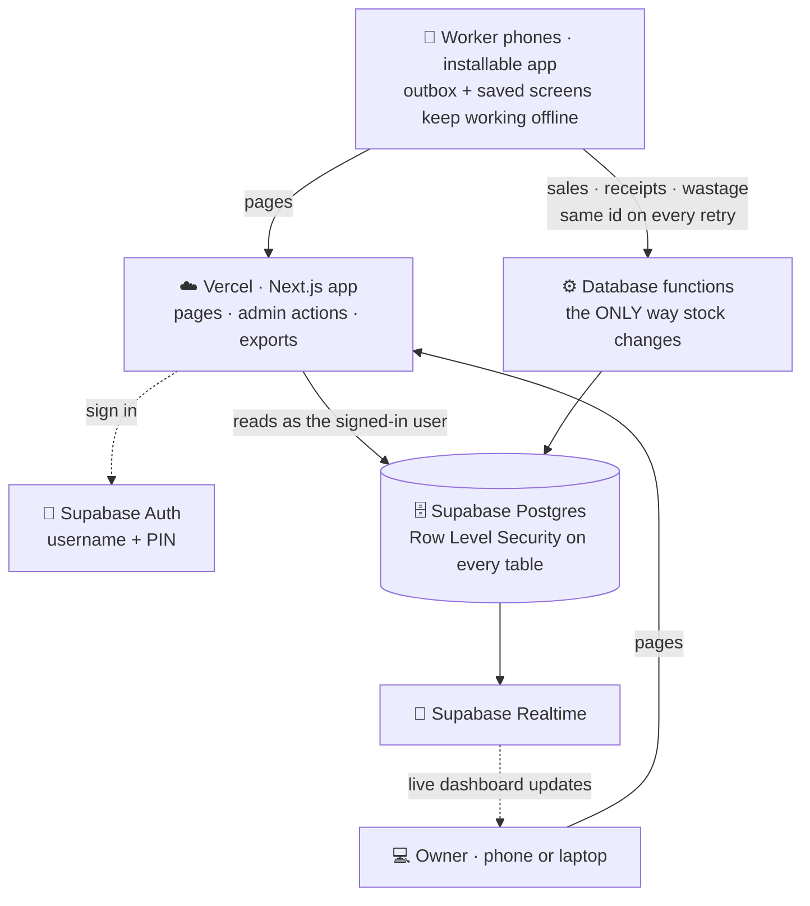

**Why it is built this way**

| Decision | Reason |
|---|---|
| All stock changes happen **inside database functions** | Each event is one transaction: the order, its lines and every ingredient deduction are saved together or not at all. Security is enforced in the database, not the browser. |
| **Append-only ledger** (`stock_movements`) + cached balances (`stock_levels`) | History can never be silently edited; balances are fast to read and always reconcilable with the ledger. |
| **Client-generated document ids** | A phone that retries after a dropped connection sends the same id, and the database ignores the repeat — nothing is counted twice. |
| **Row Level Security** on every table | A worker's login can only ever read their own cart's data, whatever the app does. |
| **PWA + outbox** instead of a native app | No app store; works on Android and iPhone; sales keep working without signal. |

---

## 3. From a sale to stock: the ledger

### One sale, step by step

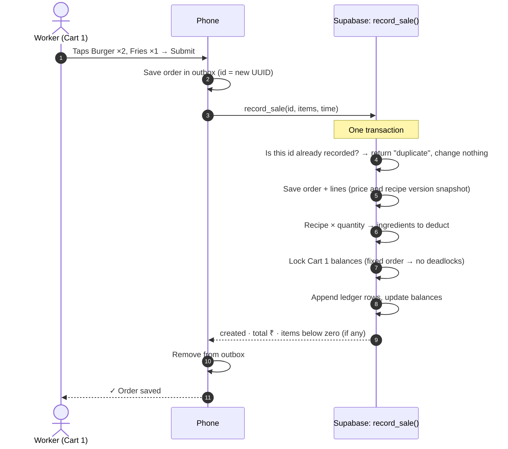

### Example

Recipe: **Burger** = 1 Bun + 1 Patty + 20 g Mayonnaise. Cart 1 sells **Burger × 3**:

| Material | Before | Ledger row added | After |
|---|---:|---|---:|
| Bun | 20 pcs | `SALE_CONSUMPTION −3` | 17 pcs |
| Patty | 20 pcs | `SALE_CONSUMPTION −3` | 17 pcs |
| Mayonnaise | 1 kg | `SALE_CONSUMPTION −60 g` | 940 g |

If the phone loses signal and sends the **same order again**, the database answers `duplicate` and the
stock stays at **17 — not 14**. This exact case is an automated test.

### Every way stock can change

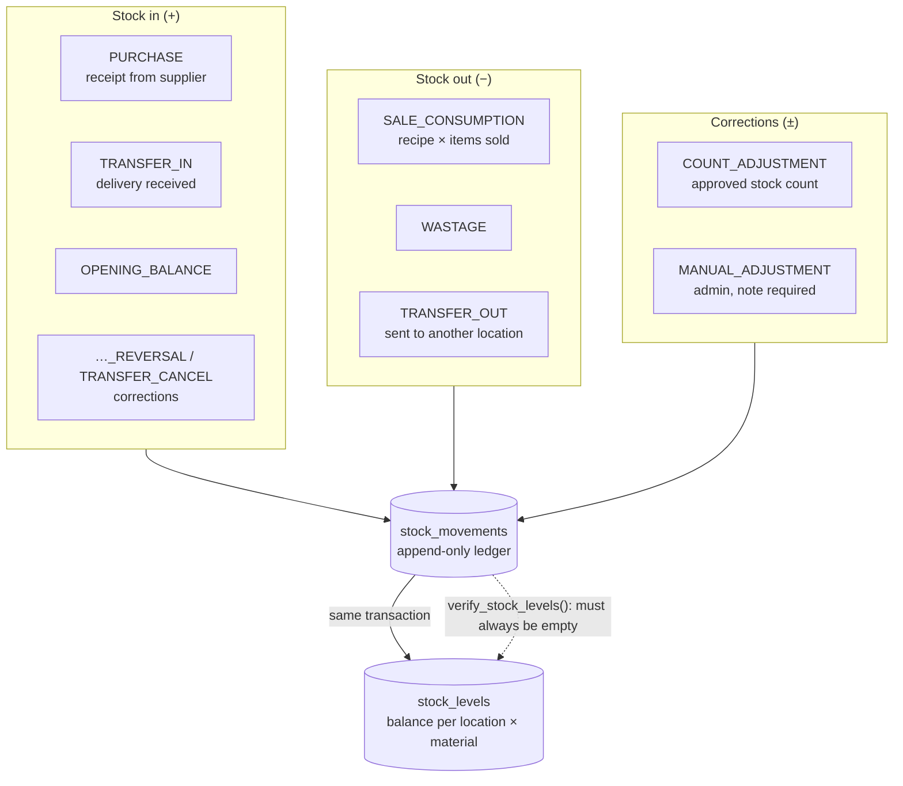

Nothing is ever deleted or edited. A mistake is corrected by a **reversal** (e.g. voiding an order returns its
ingredients) that appears in the history next to the original, with who did it and why.

---

## 4. Data model

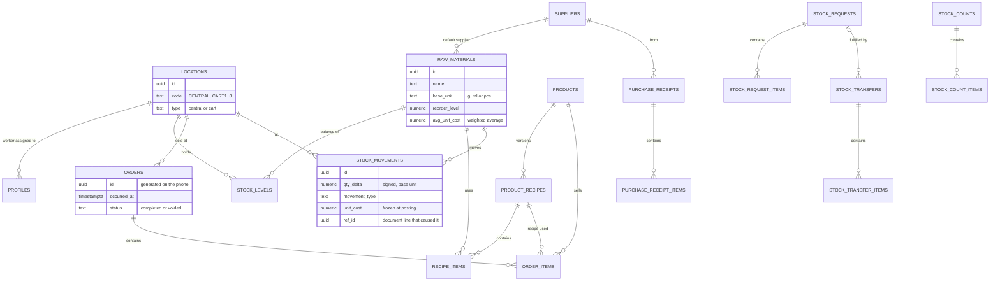

**Units.** Every quantity is stored in the material's **base unit** — grams, millilitres or pieces — as an exact
decimal (`numeric(14,3)`, never floating point). The screens accept and show kg, l, dozen or a material's own
packaging ("pack of 6") and convert.

**Recipes are versioned.** Editing a recipe creates a new version; each order line stores the version it used,
so past consumption and costs never change when a recipe changes. A sale recorded offline uses the recipe that
was in force *when it happened*.

The full design notes are in **[docs/ARCHITECTURE.md](docs/ARCHITECTURE.md)**.

---

## 5. Business rules

| # | Rule | Where it is enforced |
|---|---|---|
| 1 | A sale consumes ingredients according to the product's recipe at the time of the sale | `record_sale()` |
| 2 | A receipt increases stock at the receiving location | `record_receipt()` |
| 3 | Wastage decreases stock and records its cost | `record_wastage()` |
| 4 | Transfers move stock: out of the source when sent, into the destination when received — never counted twice | `create_transfer()` / `receive_transfer()` |
| 5 | Stock may not go below zero — **except sales**, which are flagged instead (the food is already served; offline sales may arrive late). Both are switches in Settings. | every stock function |
| 6 | History is never deleted — corrections are reversals | triggers block UPDATE/DELETE |
| 7 | Every stock change is atomic | one database transaction per event |
| 8 | Worker permissions are enforced by the database | Row Level Security + functions |
| 9 | Every stock change has a traceable cause and author | ledger `ref_type`/`ref_id`, `created_by`, audit log |
| 10 | Recipe changes never rewrite history | recipe versioning |

### Transfers

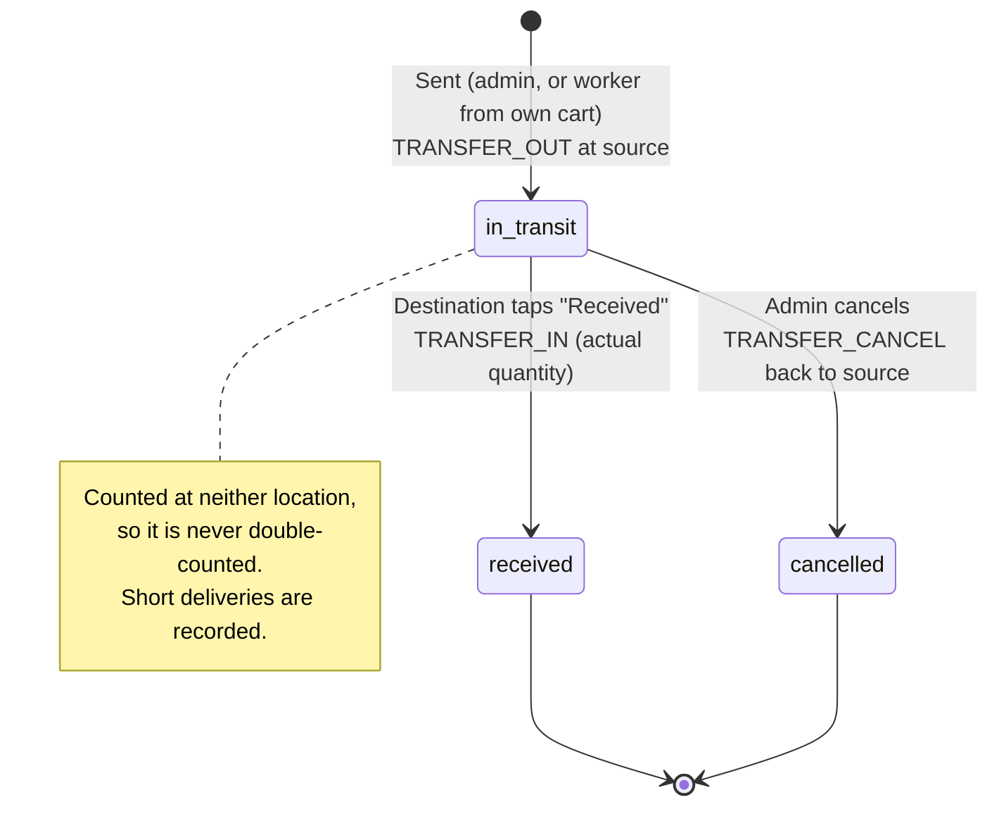

### Stock requests and stock counts

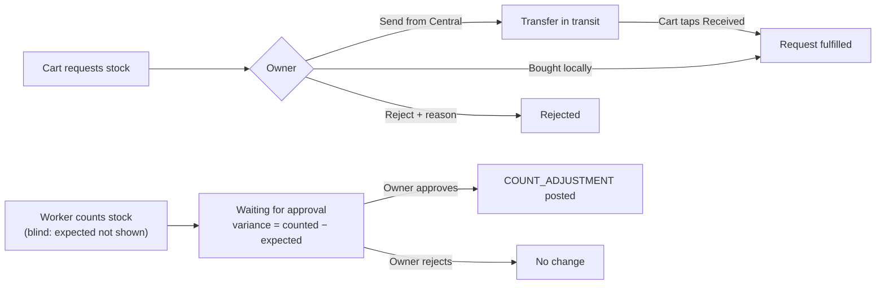

A count's variance is measured **at the moment of counting**, so sales made between counting and approval are
not corrected twice. Differences are labelled only as **inventory variance** — the app never assumes theft or error.

---

## 6. Stock alerts and runway

For each material (business-wide, or per location):

- **Average daily use** = sales consumption + wastage over the last **7 days** (configurable)
- **Days left** = current stock ÷ average daily use
- Fewer than **3 days** of history → **"insufficient data"** instead of a guess

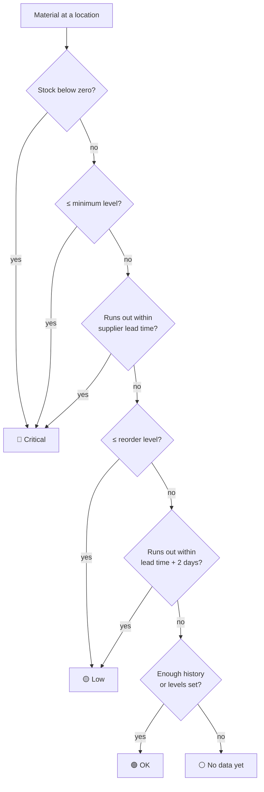

**Suggested order** = target stock − current stock, or, without a target,
daily use × (lead time + 7 days) − current stock.

**Costs** use a moving **weighted-average cost** per material, updated by every priced purchase. The unit cost is
frozen on each ledger row, so past cost figures never change. Product margins are shown as
**"estimated gross margin before other expenses"** — not profit.

---

## 7. Offline mode

Sales, stock receipts and wastage work **without signal**. They are saved on the phone first and sent when possible.

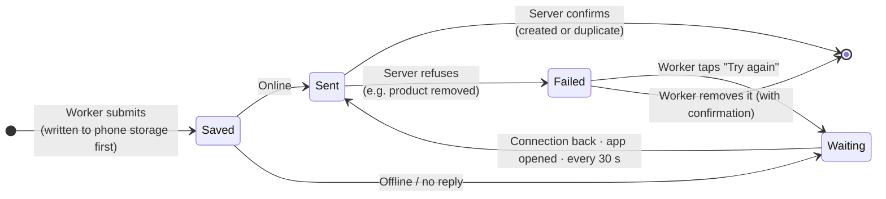

| What the worker sees | Meaning |
|---|---|
| 🟢 **Order saved** | The server has it |
| 🟡 **Saved on this phone · will sync** | Safe on the phone; sent automatically later |
| Header pill `OFFLINE — 3 PENDING SYNC` / `SYNCING 2…` / `⚠ 1 FAILED` | Tap it to see each waiting item |

- The **same id** is sent on every retry and the database ignores repeats → **never counted twice**.
- Items are sent oldest-first; only by the person who recorded them.
- A refused item is **never dropped silently** — it waits for the worker to retry or remove it.
- The worker screens (menu, prices, materials) are saved on the phone while online, so the app opens without signal.
- Requests, transfers, stock counts and all admin screens need a connection.
- Sync within **3 days**; the server does not accept back-dating beyond 72 hours.

---

## 8. Security

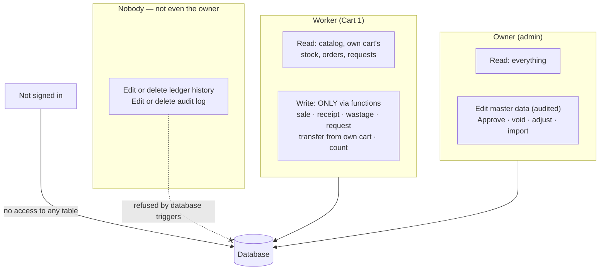

- **Row Level Security on every table.** A worker's session can only read its own cart, however the app is used.
- **Workers cannot write tables directly.** Every change goes through a database function that takes the cart
  from the worker's profile, never from the request.
- **Append-only history.** Database triggers refuse any UPDATE/DELETE on the ledger and audit log.
- **Audit log** of every master-data change and admin action (who, when, old value, new value).
- **Secret key stays on the server.** `SUPABASE_SECRET_KEY` is used only to create worker logins and never reaches a browser.
- **Exports** are admin-only, and text cells are neutralised so Excel cannot run formulas from app data.
- **Deactivating** a worker blocks sign-in immediately.

---

## 9. Screens

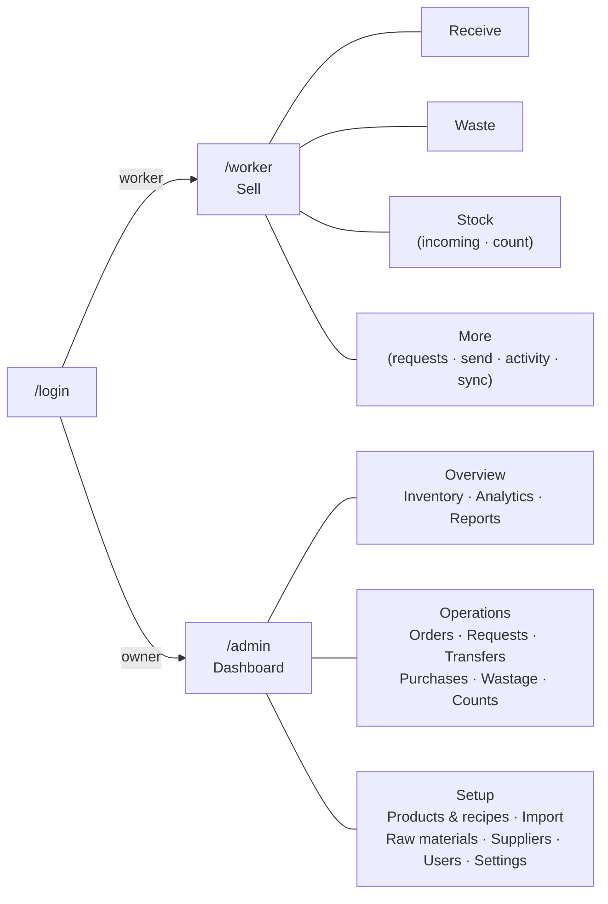

Worker screens are designed for one hand at a busy cart: large tiles, bottom tabs within thumb reach, numeric
keypads, high contrast for sunlight, and no confirmation dialogs on the Sell screen.

---

## 10. Excel import and exports

### Recipe sheet format

One row per product, one column per raw material, quantities in the cells:

| Product | Price | Burger Bun | Mayonnaise | Milk  | Lemon |
|---------|------:|-----------:|-----------:|------:|------:|
| Burger  | 120   | 1          | 20gm       |       |       |
| Shake   | 110   |            |            | 200ml |       |
| Mojito  | 90    |            |            |       | 0.5   |

- Plain numbers are **pieces**; `g / gm / kg` and `ml / l` are converted to grams / millilitres.
- The **Price** column is optional (also `Selling price` or `MRP`).
- Example file: [`data/sample-recipes.xlsx`](data/sample-recipes.xlsx).

**Admin → Import from Excel** reads `.xlsx`, `.xls` or `.csv` in the browser and shows a preview —
new materials, new products, each recipe change (`Patty 1 → 2 · + Mayo 20gm`) and each price change — before
anything is saved. Problems are listed with row numbers and block the import. The import is **all-or-nothing**,
and re-importing the same file changes nothing.

### Reports (Admin → Reports & export, Excel or CSV)

| Report | Contents |
|---|---|
| Sales | Every order line — date/time, cart, product, quantity, price, worker |
| Inventory | Stock per location, total, cost, value, status, days left |
| Stock movements | The complete ledger for the period, with reasons |
| Purchases | Supplier, bill number, quantity, amount paid, price per unit |
| Wastage | Material, reason, cost, recorded by |
| Ingredient consumption | Used in sales vs wasted vs inventory variance vs actual use, purchases, transfers |
| Recipes | Current recipes and prices **in the import format** — edit in Excel and re-import |

Supabase stays the single source of truth; Excel is only for import and export.

---

## 11. Setup

**Requirements:** Node.js 22+, a free [Supabase](https://supabase.com) account. Docker is **not** needed.

### 1. Supabase project

1. Create a project (region **Mumbai / ap-south-1**).
2. **Authentication → Sign In / Providers → Email:** turn **off** "Allow new users to sign up", turn **off**
   "Confirm email", set minimum password length to **6** (worker PINs are 6 digits).
3. **Project Settings → API Keys:** note the project URL, the **publishable** key and a **secret** key.

### 2. Local environment

```bash
npm install
cp .env.example .env.local     # fill in the values below
```

| Variable | Where it is used | Secret? |
|---|---|---|
| `NEXT_PUBLIC_SUPABASE_URL` | browser + server | no |
| `NEXT_PUBLIC_SUPABASE_PUBLISHABLE_KEY` | browser + server (protected by RLS) | no |
| `SUPABASE_SECRET_KEY` | server only — creating worker logins | **yes** — never commit, never prefix with `NEXT_PUBLIC_` |
| `LOGIN_EMAIL_DOMAIN` | maps usernames to login addresses (e.g. `staff.cafescm.app`); no email is ever sent | no — but never change it once users exist |

### 3. Database (migrations)

```bash
npx supabase login
npx supabase link --project-ref <your-project-ref>
npx supabase db push
```

### 4. Owner account

```bash
node --env-file=.env.local scripts/create-admin.mjs you@example.com "Your Name"
```

The password is typed twice and hidden. Signing in with a real email lets you use Supabase password reset.

### 5. Run it

```bash
npm run dev          # http://localhost:3000
```

Sign in as the owner, then **Admin → Users → Add worker** for each cart (name, username, cart, 6-digit PIN).

### 6. Sample data (optional)

```bash
node --env-file=.env.local scripts/seed-sample.mjs you@example.com
```

Loads Burger, Roll, Fries, Shake and Mojito with recipes, prices, sample costs and opening stock.

> On Windows PowerShell, prefer the `node --env-file=…` commands above over `npm run … -- <args>`:
> npm can pass the arguments incorrectly there.

---

## 12. Deployment

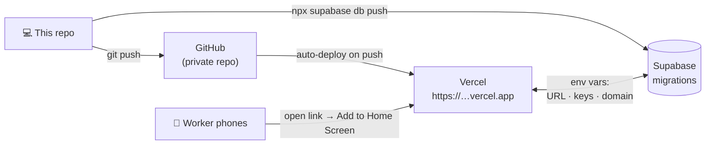

1. Push the repo to GitHub.
2. On [vercel.com](https://vercel.com): **Add New → Project → Import** the repo.
3. Add the four environment variables from `.env.local` (same names), then **Deploy**.
4. In Supabase **Authentication → URL Configuration**, set the **Site URL** to the Vercel address.
5. Each worker opens the link on their phone, signs in, and taps **Add to Home Screen**.

Every later `git push` to `main` redeploys automatically. Database changes are applied separately with
`npx supabase db push`.

---

## 13. Go-live checklist

- [ ] Supabase project created, auth settings as in [Setup](#1-supabase-project), migrations applied
- [ ] Owner account created; one worker per cart with a 6-digit PIN
- [ ] Real menu imported (**Admin → Import from Excel**); prices checked under **Products**
- [ ] Raw materials: reorder levels, lead times and default suppliers set
- [ ] Opening stock entered for every location (a stock count per location, or **Inventory → material → Adjust stock**)
- [ ] Deployed to Vercel; Site URL set in Supabase
- [ ] Each worker: signed in on their phone, **Add to Home Screen**, opened every tab once while online
- [ ] Offline test: airplane mode → sell one item (amber "Saved on this phone") → back online → it appears once under **Admin → Orders**
- [ ] Optional: `node --env-file=.env.local scripts/check-concurrency.mjs <worker>` on sample data (20 simultaneous sales incl. 5 repeats → exactly 15 recorded), then void the test orders

---

## 14. Development

```bash
npm run dev            # local app on http://localhost:3000
npm test               # all tests (unit + database)
npm run check          # typecheck + lint + tests — same as CI
npm run build          # production build
npm run sample:excel   # regenerate data/sample-recipes.xlsx
```

### How the database is tested without Docker

The database tests run the **real migrations** on [PGlite](https://pglite.dev) — Postgres compiled to
WebAssembly, running inside the test process — with a small shim for Supabase's `auth.uid()` and roles.
They sign in as the owner or as a specific worker, so Row Level Security is tested exactly as it runs in
production.

| Test suite | What it proves |
|---|---|
| `foundation` | Locations, roles, RLS per cart, no direct writes, append-only history |
| `sales` | Recipe deduction, **retry → no double count**, rollback, recipe versioning, void |
| `inventory` | Receipts & weighted cost, wastage, transfers (no double count), requests, counts |
| `analytics` | Runway maths, dashboard totals, IST day boundaries, cost history |
| `import` | Prices, all-or-nothing rollback |
| `offline/engine` | Retry, stop-on-network-error, failed items kept, single send, per-user |
| `offline/idb-store` | Orders survive an app restart and are delivered exactly once |

### Rules for changes

- Database changes go in a **new** file in `supabase/migrations/` — never edit one that has been applied — with tests in `tests/db/`.
- Stock may only change inside a `SECURITY DEFINER` function that writes `stock_movements` and `stock_levels` in the same transaction.
- Quantities are `numeric(14,3)` in base units; no floating point for stock maths.
- Run `npm run check` before committing. CI (GitHub Actions) runs the same checks on every push.

---

## 15. Project structure

```text
├─ src/
│  ├─ app/
│  │  ├─ login/                 sign in (username + PIN, or email for the owner)
│  │  ├─ worker/                Sell · Receive · Waste · Stock · More · Sync
│  │  └─ admin/                 dashboard, inventory, analytics, operations, setup, import, export
│  ├─ components/               shared UI (forms, charts, status pills, offline boot)
│  └─ lib/
│     ├─ offline/               outbox engine, IndexedDB store, submit hooks
│     ├─ supabase/              browser / server / admin clients, session proxy
│     ├─ recipe-sheet.ts        Excel recipe parser (+ export formatter)
│     ├─ import-preview.ts      what an import would change
│     ├─ reports.ts, export.ts  CSV/Excel exports
│     └─ analytics.ts           typed wrappers for analytics functions
├─ supabase/migrations/         the complete database: tables, RLS, functions, analytics
├─ tests/db/                    database tests on PGlite
├─ scripts/                     create-admin, seed-sample, check-concurrency, sample Excel
├─ public/sw.js                 service worker (offline screens)
├─ data/sample-recipes.xlsx     example recipe sheet
└─ docs/ARCHITECTURE.md         design decisions and data model in detail
```

---

## 16. Troubleshooting

| Symptom | Cause / fix |
|---|---|
| Sign-in says wrong username or PIN | Check the username (lower-case) and PIN; the owner may reset the PIN under **Users**. A disabled worker cannot sign in. |
| Owner login fails right after setup | Make sure `create-admin` printed "Admin created" before running `seed-sample`. |
| On a phone via `http://192.168.x.x:3000`, buttons do nothing | Development server only: restart `npm run dev` (the network addresses are allowed in `next.config.ts`) and reload. On the Vercel link this does not apply. |
| Header shows `⚠ FAILED` | The server refused a document (e.g. a product was deactivated). Tap the pill → **Try again** or **Remove**, and tell the owner. |
| Header shows `PENDING SYNC` for a long time | The phone has no connection to Supabase. Items are safe; they send when it reconnects. Sync within 3 days. |
| Stock shows **CHECK** / below zero | Sales were recorded without enough recorded stock (allowed by design). Record the missing receipt or do a stock count. |
| Import is blocked | Fix the rows listed in the preview (row numbers are shown), or units that differ from the app. |
| "Database error creating new user" | Apply all migrations (`npx supabase db push`); profiles are created by the app, not a database trigger. |
