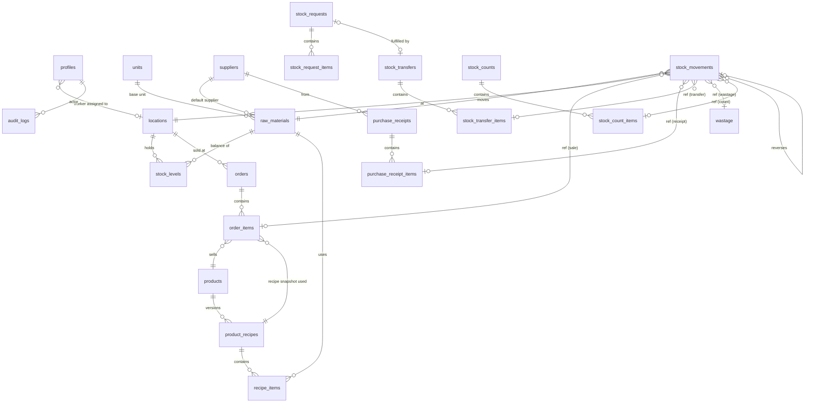

# Cafe SCM — Architecture Proposal (v0.1, for review)

Internal supply-chain & inventory PWA for 3 food carts + central storage.
Status: **confirmed 2026-09-24 — Phase 1 implemented.**

### Decisions confirmed by the owner
- **Negative stock:** sales may take stock below zero (the food is already served; offline sales may sync late). It is flagged, not blocked. Wastage, transfers and adjustments are blocked from going negative. Both are switches in `app_settings`.
- **Login:** username + 6-digit PIN for workers; the owner creates accounts under Admin → Users.
- **Timezone / currency:** Asia/Kolkata, INR. One selling price per product across all carts.
- **Recipe sheet:** products as rows, raw materials as column headings, quantities in cells (`20gm`, `200ml`, or a plain number = pieces). See `data/sample-recipes.xlsx`.
- **No Docker:** database tests run on PGlite (Postgres compiled to WASM, in-process) with a Supabase `auth` shim; the app runs against a hosted Supabase project.

---

## 1. Proposed architecture

```
 Worker phones (Android/iOS PWA)        Owner (phone / laptop)
        │  IndexedDB outbox                     │
        │  service worker (app shell cache)     │
        └──────────────┬────────────────────────┘
                       │ HTTPS
              ┌────────▼─────────┐
              │  Next.js on Vercel│  App Router, TypeScript, Tailwind
              │  - UI (RSC + client components)
              │  - Server Actions / Route Handlers ONLY for
              │    admin user management + file import/export
              └────────┬─────────┘
                       │ supabase-js (user JWT)  ← all normal reads/writes
              ┌────────▼──────────────────────────────┐
              │ Supabase                               │
              │  Auth ─ JWT carries user id            │
              │  Postgres ─ tables + RLS               │
              │     └ SECURITY DEFINER RPCs = the ONLY │
              │       way inventory changes            │
              │  Realtime ─ stock_levels, orders, ...  │
              └────────────────────────────────────────┘
```

Key decisions:

| Decision | Choice | Why |
|---|---|---|
| Business logic location | **Postgres functions (RPC)** | One transaction per business event; atomicity and authorization enforced in the DB, not the browser. |
| Frontend | Next.js (App Router) + TS + Tailwind | As requested; deploys natively on Vercel. |
| PWA | Serwist (maintained successor of next-pwa) + web manifest | Works with App Router; app shell precache. |
| Offline queue | IndexedDB (via `idb`) outbox, foreground sync | iOS Safari has no Background Sync API, so sync on app open / `online` event / timer. |
| Charts | Recharts | Simple, readable, small set of chart types. |
| Excel | SheetJS (official CDN build) for parse + export | Import/export only; never on the live order path. |
| Tests | Vitest + PGlite (DB logic and RLS, in-process Postgres) + Playwright later for a few critical flows | Business rules live in SQL, so SQL is tested directly — without Docker. |
| Migrations | Supabase CLI (`supabase/migrations/*.sql`) | Versioned in Git, reproducible. |

Small deviations from the prompt's table list (intentional):
- **`carts` + `inventory_locations` merged into one `locations` table** (`type = central | cart`). A cart *is* a stock location; two tables would duplicate identity.
- **No `roles` table.** Only two roles exist; `profiles.role` enum (`admin | worker`) is simpler and safer for RLS.
- **`wastage` is a document table** (reason, worker, photo later) and its quantity effect is a `WASTAGE` stock movement — same pattern for every event.
- **Added `stock_counts`** (physical counts) — required for the "inventory variance" analytics (section H/N). Without counts, variance cannot exist, because consumption is computed from recipes.
- **Added `stock_levels`** — a cached balance table maintained *only* by the RPCs, always reconcilable to the ledger.

---

## 2. Database ERD



---

## 3. Tables and relationships

All PKs `uuid` (default `gen_random_uuid()`), all tables have `created_at timestamptz`; mutable master tables also `updated_at` (trigger). Quantities are **`numeric(14,3)`**, money **`numeric(12,2)`**, unit costs **`numeric(14,4)`** — no floats anywhere.

### Identity & locations
| Table | Key columns |
|---|---|
| `profiles` | `id` (= `auth.users.id`), `full_name`, `username`, `role` (`admin`/`worker`), `location_id` (nullable for admin; required for worker), `is_active` |
| `locations` | `id`, `code` (`CENTRAL`, `CART1`…), `name`, `type` (`central`/`cart`), `is_active` |
| `app_settings` | singleton row: `timezone` (`Asia/Kolkata`), `currency` (`INR`), `runway_window_days` (7), `min_history_days` (3), `allow_negative_on_sale`, `allow_negative_other` |

### Catalog
| Table | Key columns |
|---|---|
| `units` | `code`, `base_code` (self for base units g / ml / pcs), `factor_to_base` (kg→1000 g, l→1000 ml, dozen→12 pcs). Packaging such as "pack of 6 buns" or "750 ml bottle" is per material in `material_unit_conversions`. |
| `raw_materials` | `id`, `name`, `sku`, `base_unit` (FK units; must be the dimension's base: g / ml / pcs-like), `display_unit` (e.g. kg), `min_level`, `reorder_level`, `target_level`, `default_supplier_id`, `lead_time_days`, `avg_unit_cost` (per base unit), `is_active` |
| `material_location_settings` | optional per-location override of `min/reorder/target` (a cart needs far less than central) — PK (`material_id`,`location_id`) |
| `suppliers` | `id`, `name`, `phone`, `notes`, `is_active` |
| `products` | `id`, `name`, `category`, `selling_price`, `sort_order`, `color`, `is_active` |
| `product_recipes` | `id`, `product_id`, `version` int, `effective_from`, `effective_to` (null = current), `created_by`. Partial unique index: one open version per product. |
| `recipe_items` | `recipe_id`, `material_id`, `quantity` (in the material's **base unit**), `entered_qty` + `entered_unit` (what the admin typed, for display) |

**Units rule:** every quantity is stored in the material's base unit (g, ml, pcs…). The UI accepts "2 kg" and converts to 2000 g using `units.factor_to_base`. Cross-dimension conversion (kg ↔ pcs) is not allowed unless a material defines its own pack size (e.g. `pack` of 6 buns = 6 pcs) — stored as a material-specific unit conversion row.

### Events (documents)
| Table | Key columns |
|---|---|
| `orders` | `id` = **client-generated UUID (idempotency key)**, `location_id`, `worker_id`, `occurred_at` (device time), `received_at` (server time), `status` (`completed`/`voided`), `total_amount`, `void_reason`, `voided_by` |
| `order_items` | `order_id`, `product_id`, `recipe_id` (snapshot of version used), `quantity`, `unit_price` (snapshot), `line_total` |
| `purchase_receipts` | `id` (client UUID), `location_id`, `supplier_id`, `invoice_ref`, `received_by`, `occurred_at`, `notes`, `status` |
| `purchase_receipt_items` | `receipt_id`, `material_id`, `quantity_base`, `entered_qty`, `entered_unit`, `unit_cost`, `line_cost` |
| `wastage` | `id` (client UUID), `location_id`, `material_id`, `quantity_base`, `reason` (`dropped`/`spoiled`/`damaged`/`expired`/`prep_waste`/`other`), `notes`, `recorded_by`, `occurred_at`, `status` |
| `stock_transfers` | `id`, `from_location_id`, `to_location_id`, `status` (`in_transit`/`received`/`cancelled`), `created_by`, `dispatched_at`, `received_by`, `received_at`, `request_id` |
| `stock_transfer_items` | `transfer_id`, `material_id`, `qty_sent`, `qty_received` |
| `stock_requests` | `id`, `location_id`, `requested_by`, `status` (`pending`/`approved`/`fulfilled`/`rejected`), `needed_by`, `notes`, `resolved_by` |
| `stock_request_items` | `request_id`, `material_id`, `quantity_base` |
| `stock_counts` | `id`, `location_id`, `counted_by`, `counted_at`, `status` (`draft`/`posted`) |
| `stock_count_items` | `count_id`, `material_id`, `expected_qty` (snapshot), `counted_qty`, `variance` (generated) |

### Ledger & audit
| Table | Key columns |
|---|---|
| `stock_movements` | `id`, `material_id`, `location_id`, `qty_delta` (signed, base unit), `movement_type`, `unit_cost` (snapshot at posting), `ref_type` + `ref_id` (the source document line), `reverses_movement_id`, `created_by`, `occurred_at`, `created_at`, `notes`. **Append-only**: UPDATE/DELETE revoked + blocking trigger. |
| `stock_levels` | PK (`location_id`,`material_id`), `quantity`, `updated_at`. Written only by RPCs, inside the same transaction as the movement. |
| `audit_logs` | `id`, `actor_id`, `action`, `entity`, `entity_id`, `old_value jsonb`, `new_value jsonb`, `created_at`. Filled by triggers on master tables + by RPCs. |

`movement_type` enum: `PURCHASE`, `SALE_CONSUMPTION`, `SALE_REVERSAL`, `TRANSFER_OUT`, `TRANSFER_IN`, `TRANSFER_CANCEL`, `WASTAGE`, `WASTAGE_REVERSAL`, `COUNT_ADJUSTMENT`, `MANUAL_ADJUSTMENT`, `OPENING_BALANCE`.

**One movement row = one location effect.** A transfer is two rows (−5 at Cart 1, +5 at Cart 3), never one row with source+destination — that makes "stock at location X = SUM(qty_delta) WHERE location = X" trivially correct and avoids double counting. The transfer document carries the from/to pairing.

Indexes: `stock_movements (location_id, material_id, occurred_at)`, `(material_id, occurred_at)`, `(ref_type, ref_id)`; `orders (location_id, occurred_at)`; `order_items (product_id)`; FKs indexed.

---

## 4. Inventory calculation logic

**Invariant:** `stock_levels.quantity = SUM(stock_movements.qty_delta)` for every (location, material). A `verify_stock_levels()` function reports any drift (should always be empty; tested).

### `record_sale(p_order_id uuid, p_occurred_at timestamptz, p_items jsonb)` — one transaction
1. Resolve caller → `profiles.location_id`; reject if not an active worker/admin.
2. **Idempotency:** `INSERT INTO orders ... ON CONFLICT (id) DO NOTHING`. If the row already existed → return the existing order unchanged (no second deduction). *(This is the "Patty stays 17, not 14" test.)*
3. For each item: load product (must be active) + the recipe version effective at `occurred_at`; insert `order_items` with `recipe_id` and `unit_price` snapshots.
4. Explode: `consumption = SUM(recipe_items.quantity × order_items.quantity)` grouped by material.
5. Lock balances in a **deterministic order** (`ORDER BY material_id` + `SELECT … FOR UPDATE` on `stock_levels`, upserting missing rows) → no deadlocks between concurrent carts.
6. Negative-stock check per `app_settings` (sales: allowed and flagged; everything else: blocked).
7. Insert `SALE_CONSUMPTION` movements (with `unit_cost` = current `avg_unit_cost`) and update `stock_levels`.
8. Return order id + resulting balances. Any exception → whole transaction rolls back; nothing is saved.

### Other RPCs (same pattern: client UUID idempotency, lock, move, update cache)
- `record_receipt(...)` → `PURCHASE` +qty; recalculates **moving weighted-average cost**:
  `new_avg = (on_hand_total × old_avg + qty × unit_cost) / (on_hand_total + qty)`.
- `record_wastage(...)` → `WASTAGE` −qty.
- `create_transfer(...)` (admin; or worker for own cart as source) → `TRANSFER_OUT` at source, status `in_transit`.
- `receive_transfer(...)` (destination worker/admin) → `TRANSFER_IN` of `qty_received`; any shortfall is shown as a transfer discrepancy (not silently lost).
- `cancel_transfer(...)` (admin, only while in transit) → `TRANSFER_CANCEL` back to source.
- `post_stock_count(...)` → `COUNT_ADJUSTMENT` = counted − expected. **This is where inventory variance lives.**
- `void_order(...)`, `void_wastage(...)` (admin) → reversal movements linked via `reverses_movement_id`, document marked `voided`, audit log row. Nothing is ever deleted.
- `adjust_stock(...)` (admin) → `MANUAL_ADJUSTMENT`, mandatory note.

### Recipe versioning (Rule 10)
Editing a recipe never updates `recipe_items` in place: `save_recipe(product_id, items)` closes the current version (`effective_to = now()`) and inserts version n+1. Orders store the `recipe_id` they consumed with, and consumption movements are already written — history is immutable by construction.

### Derived numbers
- **Current stock:** `stock_levels` (fast) — verifiable against ledger.
- **Avg daily consumption:** `SUM(-qty_delta)` of `SALE_CONSUMPTION` + `WASTAGE` over the last `runway_window_days` ÷ days with activity; if fewer than `min_history_days` → *"Insufficient data"*.
- **Days remaining** = current ÷ avg daily consumption.
- **Status:** 🔴 Critical if `≤ min_level` or days remaining ≤ lead time; 🟡 Low if `≤ reorder_level`; 🟢 OK otherwise.
- **Suggested reorder qty** = `max(0, target_level − current)`, or if no target: `avg_daily × (lead_time + cover_days) − current`.
- **Ingredient cost per product** = `Σ recipe qty × avg_unit_cost` (labelled *"Estimated ingredient cost — weighted-average costing"*); margin labelled *"Estimated gross margin before other expenses"*.
- **Sales vs consumption (N):** expected = recipe × sold; actual = expected + wastage + count adjustments. Honest note: because consumption is recipe-derived, variance appears **only** once physical counts are recorded.

---

## 5. Authentication / RLS strategy

**Login:** Supabase Auth email+password, but workers see **username + 6-digit PIN**. The app maps `ravi` → `ravi@workers.cafe-scm.internal` behind the scenes. Admin creates/deactivates workers from `/admin/users` via a server-only route that uses the service-role key (never shipped to the browser). Sessions persist on the phone, so workers rarely log in.

**Helper functions** (`SECURITY DEFINER`, `STABLE`, fixed `search_path`):
`auth_role()`, `is_admin()`, `my_location_id()` — read from `profiles`.

**Policy matrix:**

| Table group | Worker SELECT | Worker INSERT/UPDATE/DELETE | Admin |
|---|---|---|---|
| products, recipes, raw_materials, units, suppliers | active rows (needed for UI) | ✗ | full (via RPC/forms, audited) |
| orders, order_items, receipts, wastage, counts | own `location_id` only | ✗ direct — **RPC only** | full read; corrections via RPC |
| stock_levels, stock_movements | own location only | ✗ (RPC only) | read all; no direct writes |
| stock_transfers, requests | where own location is source/destination | ✗ (RPC only) | full |
| profiles | own row | ✗ | full |
| audit_logs, app_settings | ✗ / read settings | ✗ | read |

- `authenticated` role has `INSERT/UPDATE/DELETE` **revoked** on all ledger/event tables. The only write path is RPCs, which check `my_location_id()` against the target location inside the function. A worker calling `record_sale` for another cart's location is impossible — the function ignores any location parameter and uses the caller's.
- `stock_movements` and `audit_logs` have a trigger that raises on UPDATE/DELETE, even for admin.
- pgTAP tests log in as worker A and assert they can't read cart B, can't insert movements, can't edit recipes.

---

## 6. Worker user flow

Bottom tab bar (thumb reach): **Sell · Receive · Waste · Stock · More** (More = Requests, Recent activity, Logout). Header: cart name + `● ONLINE` / `● OFFLINE — 3 pending sync`.

**Sell (default screen)**
```
┌──────────────────────────────┐
│ Cart 2          ● ONLINE      │
├──────────────┬───────────────┤
│  Burger   2  │   Fries   1   │   ← big tiles, tap = +1
├──────────────┼───────────────┤     long-press / (−) chip = −1
│ Cold Coffee  │  Sandwich     │
├──────────────┴───────────────┤
│ 3 items · ₹360      [ Clear ] │
│ [      SUBMIT ORDER        ]  │   ← full-width, bottom
└──────────────────────────────┘
```
Submit → order written to IndexedDB outbox **first**, then sent → green "✓ Order saved" toast (1.5 s), tiles reset. No confirmation dialog. If offline: amber "Saved — will sync".

**Receive:** searchable material picker (recent materials first) → quantity keypad with unit chips (kg / g) → optional supplier, invoice ref, cost → **CONFIRM RECEIPT**.
**Waste:** material → qty → reason chips (Dropped / Spoiled / Damaged / Expired / Prep / Other) → **SUBMIT**.
**Stock:** list of own-cart materials with status dots, sorted critical first; tap = recent movements. Incoming transfers show "Receive" button.
**Requests:** pick materials + qty → send; see status.
**Recent activity:** today's orders/receipts/wastage with sync status.

---

## 7. Admin user flow

Opens `/admin` → Dashboard, answering the 8 questions from section 36-T in order:

1. **"Needs attention"** strip: 🔴 critical runway items, pending requests, transfers in transit > X hrs, unsynced/voided anomalies, count variances.
2. **Today's operations** line: orders · items · sales ₹ · purchases ₹ · wastage ₹ (with vs-yesterday delta).
3. **Stock alerts** (Critical / Low / Healthy, with days remaining).
4. **Cart cards** (sales, orders, alerts, wastage) → drill into cart.
5. Date-range filter (Today / Yesterday / 7d / 30d / custom) shared by all admin views.

Sidebar (desktop) / drawer (mobile): Dashboard, Orders, Inventory (matrix: material × Central/Cart1/Cart2/Cart3/Total → click = movement timeline), Movements, Transfers, Purchases, Suppliers, Products, Recipes, Raw Materials, Wastage, Requests, Stock Counts, Analytics, Reports/Export, Import, Users, Settings.

Typical owner loop: see "Chicken ~1.5 days" → **Create transfer Central → Cart 2** or **Record purchase** from the same alert row.

---

## 8. Realtime architecture

- Supabase Realtime `postgres_changes` on `stock_levels`, `orders`, `stock_requests`, `stock_transfers`, `wastage`. Realtime respects RLS, so workers only receive their own cart's events.
- Admin dashboard: on any event, **debounce 1–2 s then re-fetch** the affected aggregate RPC (`dashboard_summary(range)`), rather than patching numbers client-side — always correct, still feels live.
- Inventory matrix patches cells directly from `stock_levels` change payloads (exact value, no recompute).
- Worker: subscribes to own `stock_transfers` / `stock_requests` (to see incoming stock and approvals).
- Volume is tiny (~hundreds of orders/day), well inside Supabase free-tier realtime limits.

---

## 9. Offline strategy

- **Screens:** while online, the worker layout asks the service worker to save fresh copies of every worker screen *and the scripts/styles they use*. The catalog (products, prices, materials, units) is inside those pages, so worker screens open with no network. Offline, links do a full page load so the service worker can answer from its saved copies (in-app navigation would need the server).
- **Implemented in** `src/lib/offline/` (engine, IndexedDB store, React hooks) and `public/sw.js`; the engine is unit-tested with an in-memory store and with a real IndexedDB implementation.
- **Outbox** (IndexedDB): every sale / receipt / wastage is stored with a **client-generated UUID** and `occurred_at` *before* any network call.
- **Sync loop:** runs on submit, on `online` event, on app focus, and every 30 s while items are pending. Sends items **in order**; the RPC's `ON CONFLICT (id) DO NOTHING` makes retries harmless (network drop after commit → retry returns "already recorded" → item marked synced).
- **Failures:** transient (network/5xx) → retry with backoff. Permanent (validation, e.g. product disabled) → item moved to "Needs attention" list visible to the worker and admin; never silently dropped.
- **Indicator:** `● ONLINE` / `● OFFLINE — N pending sync` / `⚠ N failed` always visible.
- **Clock skew:** server stores both `occurred_at` (device) and `received_at`; `occurred_at` is clamped to `[received_at − 72 h, received_at + 5 min]`.
- Transfers, counts and all admin actions are **online-only** (they need current server state).
- iOS caveat: workers should "Add to Home Screen"; iOS may evict storage for PWAs unused for weeks — irrelevant for daily use, and the outbox is drained every time the app is opened online.

---

## 10. Deployment architecture

```
GitHub repo ──push──▶ Vercel (preview per branch, production on main)
     │
     └── supabase/migrations ──(supabase db push)──▶ Supabase project (prod)
                                                    (+ optional second free project for dev)
```

- Env vars (Vercel + `.env.local`, never committed): `NEXT_PUBLIC_SUPABASE_URL`, `NEXT_PUBLIC_SUPABASE_ANON_KEY`, `SUPABASE_SERVICE_ROLE_KEY` (server-only). `.env.example` committed with blanks.
- URL: free `*.vercel.app` domain; HTTPS (required for PWA/service worker) comes for free.
- Local dev: no Docker on this machine, so the app runs against a hosted Supabase project (optionally a second free project for dev); migrations are applied with `supabase db push`.
- Free-tier notes: Supabase free projects pause after ~7 days of **no** activity (daily use prevents this); enable daily backups/export when moving to Pro. A nightly CSV export of the ledger is planned in Phase 5 as a cheap backup.
- CI (GitHub Actions): typecheck, lint, Vitest (including the PGlite database tests) on each push/PR.

---

## Build phases (unchanged from brief, with test gates)

| Phase | Scope | Exit test |
|---|---|---|
| 1 Foundation | Next.js, Supabase clients, schema migrations, auth, roles, locations, RLS, PWA shell, seed data | Worker A logs in → lands on own cart; cannot read Cart B (pgTAP). |
| 2 Worker sales | Sell screen, `record_sale`, recipe versioning, recent orders | Patty 20 → Burger×3 → 17 → retry → **17**; concurrent sales; rollback on failure. |
| 3 Inventory | Receive, wastage, transfers, requests, counts, stock view | Ledger ≡ stock_levels; transfer never double-counts. |
| 4 Admin | Dashboard, inventory matrix, alerts, runway, analytics, realtime | KPIs match hand-computed fixtures. |
| 5 Excel | Import (preview → validate → one-transaction commit), exports | Re-import is idempotent; bad rows rejected with row numbers. |
| 6 Offline | Outbox, sync, status indicator | Airplane-mode sale → reconnect → exactly one order. |

(Offline plumbing — client UUIDs + idempotent RPCs — is built into Phase 2 already; Phase 6 adds the queue/UI on top.)
